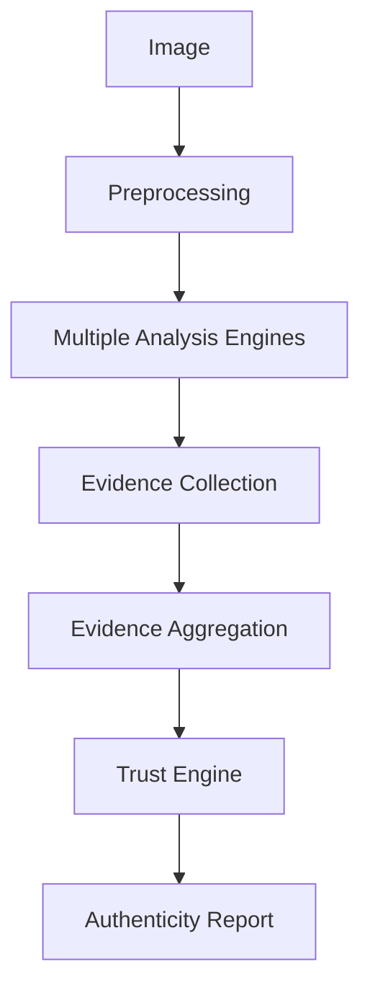
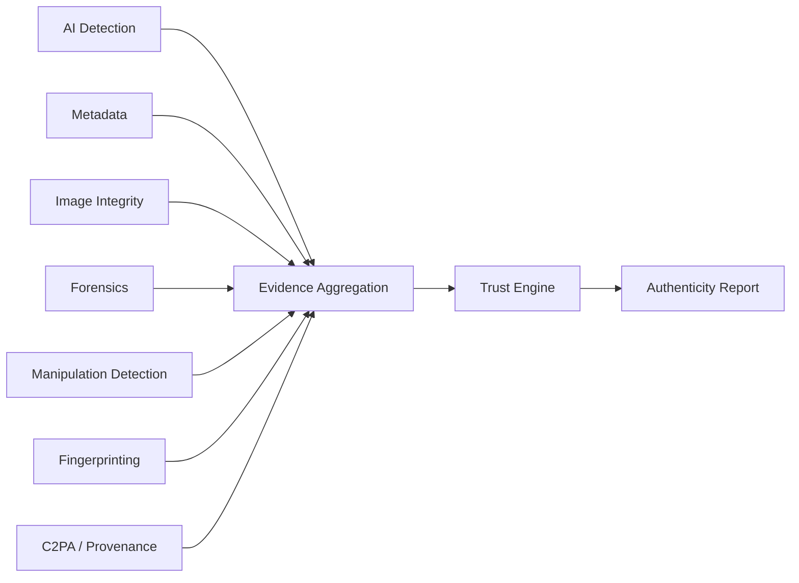
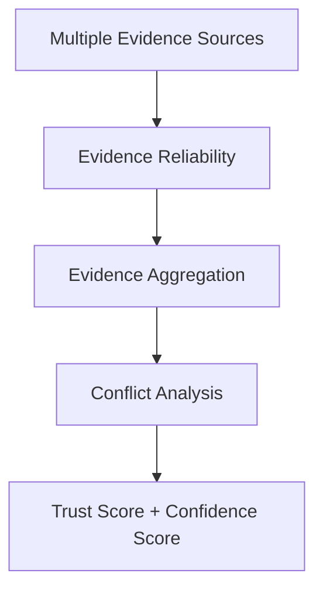
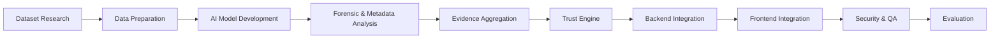
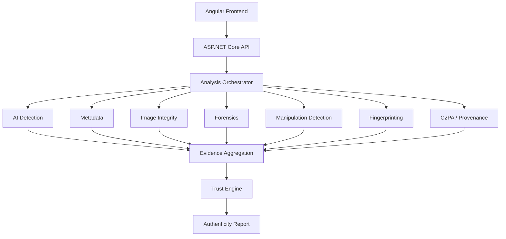
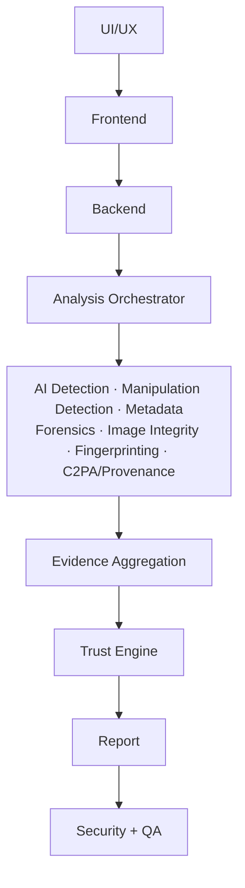
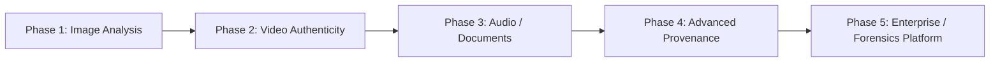

# D²SR — Digital Data Signature Report

**A multi-signal digital media authenticity assessment platform**

---

## Overview

D²SR does not ask a single question — *"Is this image Real or Fake?"*

Instead, it asks:

> **"How much independent evidence supports the authenticity of this image?"**

The system runs multiple independent analysis engines, collects their evidence, and combines it into a single explainable authenticity report — instead of relying on one AI model or one piece of metadata.



---

## 1. Problem Statement

**AI-Generated Images** Generative models now produce highly realistic images, making visual inspection alone unreliable.

**Image Manipulation** Real images can be altered via copy-move, splicing, removal, or inpainting. Beyond detecting *that* manipulation occurred, the system should identify **where** the suspicious region is.

**Metadata Loss** Metadata is often lost or altered after social media uploads, recompression, screenshots, editing, or file conversion. Metadata cannot be treated as the only source of truth.

**Single-Detector Limitation** A single AI detector can produce false positives/negatives, generalize poorly to unseen generators, and degrade after image transformations. This is why D²SR relies on multiple independent evidence sources rather than one.

---

## 2. Proposed Solution

D²SR combines several independent signals:

| Signal | Purpose |
| --- | --- |
| AI Detection | Detect likely AI-generated images |
| Metadata | Analyze available image metadata |
| Hash / Fingerprinting | Detect similarity and related images |
| Image Integrity | Analyze compression/resizing artifacts |
| Image Forensics | Analyze low-level forensic evidence |
| Manipulation Detection | Detect and localize image manipulation |
| Digital Provenance / C2PA | Verify available digital credentials |

> **No single engine determines the final result.** Each engine produces evidence, which is passed to the Trust Engine.



---

## 3. Role of AI

The AI team does not simply answer *"Real or Fake?"* — it analyzes visual content through two distinct tasks.

### AI Engineer 1 — AI-Generated Image Detection

Determines whether an image was likely generated by an AI system (e.g. Midjourney, Stable Diffusion, or other generative models).

```text
AI Generated Probability = 0.87
```

*(a model probability/estimate, not absolute truth)*

Responsibilities: dataset preparation, preprocessing, model selection, transfer learning where appropriate, training/fine-tuning, evaluation, classification, model serving, API integration.

### AI Engineer 2 — Manipulation Detection & Localization

Determines whether an originally real image has been manipulated (copy-move, splicing, removal, inpainting), and where possible, localizes the affected region.

```text
Prediction: Forged
Suspicious Region: [Heatmap / Localization Map]
```

Responsibilities: tampered-image dataset preparation, preprocessing, model development, classification, localization, heatmap generation, evaluation, model serving, API integration.

> **Key distinction:** AI Engineer 1 asks *"was this generated?"* — AI Engineer 2 asks *"was this real image altered, and where?"*

---

## 4. Other Analysis Components

**Metadata** — EXIF, camera info, timestamps, software info. Missing metadata does **not** mean an image is fake.

**Hash / Fingerprinting** — Perceptual hashing and image embeddings to identify similar or near-duplicate images and potential sources.

**Digital Signature / C2PA** — Checks for available provenance / Content Credentials. `No C2PA Found` means no provenance evidence is available — **not** that the image is fake.

**Image Integrity** — Compression artifacts, double compression, resizing, quantization traces.

**Image Forensics** — Noise patterns, sensor consistency, Error Level Analysis where appropriate.

**Manipulation Detection** — Identifies editing and, where supported, localizes suspicious regions.

---

## 5. Trust Engine

The Trust Score is **not** simply `100 - AI Probability`.



Different signals carry different reliability:

- Verified provenance provides strong evidence.
- Missing metadata is not proof of manipulation.
- An AI detector prediction is one signal among several.
- Conflicting evidence reduces confidence.

The final report contains both a **Trust Score** and a **Confidence Score**.

> **Illustrative Example — Not Benchmark Results**

```text
Trust Score: 87%
AI Generated Probability: 8%
Manipulation Probability: 11%
Confidence: 91%
```

---

## 6. Methodology



| Stage | Summary |
| --- | --- |
| 1. Dataset Research | Identify and compare datasets for AI-generated, real, and manipulated images |
| 2. Data Preparation | Cleaning, label validation, deduplication, splitting, preprocessing, augmentation |
| 3. AI Model Development | AI-generation detection, manipulation detection & localization, transfer learning |
| 4. Forensic & Metadata Analysis | Metadata extraction, fingerprinting, compression analysis, forensics, C2PA |
| 5. Evidence Aggregation | Combine outputs from all analysis engines |
| 6. Trust Engine | Generate Trust Score, Confidence Score, evidence summary |
| 7. Backend Integration | Connect AI and analysis services via APIs |
| 8. Frontend Integration | Upload, progress, results, evidence visualization, heatmaps, report |
| 9. Security & QA | Functional, integration, regression, API security, upload/malicious-file, auth testing |
| 10. Evaluation | Accuracy, precision, recall, F1, ROC-AUC, localization metrics, FP/FN analysis |

---

## 7. Datasets

**Candidate datasets currently under evaluation** — no final selection has been made.

| Dataset | Link | Use Case |
| --- | --- | --- |
| CIFAKE — Real and AI-Generated Synthetic Images | [kaggle.com/datasets/birdy654/cifake-real-and-ai-generated-synthetic-images](https://www.kaggle.com/datasets/birdy654/cifake-real-and-ai-generated-synthetic-images) | AI-generated image detection |
| CASIA 2.0 Image Tampering Detection Dataset | [kaggle.com/datasets/divg07/casia-20-image-tampering-detection-dataset](https://www.kaggle.com/datasets/divg07/casia-20-image-tampering-detection-dataset) | Manipulation detection — closest current candidate |
| CommunityForensics-Small | [huggingface.co/datasets/OwensLab/CommunityForensics-Small](https://huggingface.co/datasets/OwensLab/CommunityForensics-Small) | AI-generation side — closest current candidate |

---

## 8. Technical Challenges & Mitigation

### Challenge 1 — Metadata Loss

**Problem:** Social media, screenshots, editing, or recompression can strip or alter metadata and signatures, so it may no longer represent the original file.

**Mitigation:** Never depend on metadata alone.

```text
Metadata + AI Detection + Forensics + Image Integrity
+ Manipulation Detection + Fingerprinting + C2PA (when available)
```

AI and forensic signals let the system keep analyzing an image even when metadata is unavailable.

### Challenge 2 — Very Large AI Datasets

Some candidate datasets may reach hundreds of millions of images, creating storage, processing, training-time, and GPU challenges beyond current team resources.

**Mitigation:**

- Carefully selected subsets
- Pretrained models and transfer learning
- Representative, controlled experiments
- Data augmentation
- Cloud/GPU resources only when necessary
- Benchmarking on smaller datasets before scaling

> The project does **not** need to train on 500+ million images. The goal is a realistic, evaluated prototype — not massive-scale training.

---

## 9. Other Expected Challenges

| Risk | Mitigation |
| --- | --- |
| Model Generalization — unseen generators may reduce accuracy | Diverse datasets, cross-generator evaluation, transfer learning |
| False Positives / False Negatives — no detector is perfect | Multiple signals, report confidence rather than absolute verdicts |
| Compression / Social Media Transformations | Test against simulated transformations |
| Dataset Bias — differing distributions/generation methods | Dataset diversity, cross-dataset evaluation, bias analysis |
| Computational Cost — multiple engines increase processing time | Background jobs, async processing, caching, selective execution |
| C2PA Availability — not all images have Content Credentials | Treat missing provenance as unavailable evidence, not proof of manipulation |
| Explainability — a raw score is hard to interpret | Surface the evidence behind the final assessment |

---

## 10. Technologies

| Area | Technologies |
| --- | --- |
| Frontend | Angular, TypeScript, Tailwind CSS / Angular Material, Recharts |
| Backend | ASP.NET Core, C#, JWT, Swagger / OpenAPI |
| AI / Computer Vision | Python, FastAPI, PyTorch, OpenCV, Hugging Face |
| Database | PostgreSQL and/or SQL Server |
| Background Processing | Hangfire |
| Infrastructure | Docker, Linux, Cloud Deployment |
| Development | Git, GitHub, CI/CD |

---

## 11. System Architecture



The analysis engines run as independent Python/FastAPI services, orchestrated by the ASP.NET Core backend, and feed a shared aggregation layer before reaching the Trust Engine.

---

## 12. Team Tracks

| Track | Members | Main Responsibility |
| --- | --- | --- |
| UI/UX | 1 | User experience and interface design |
| Frontend / Angular | 2 | Web application and visualization |
| Backend / .NET | 3 | APIs, orchestration, database and services |
| AI | 2 | AI generation + manipulation detection |
| Data Analyst | 1 | Datasets, evaluation and analysis |
| Security & QA Testing | 1 | Security testing and quality assurance |
| **Total** | **10** |  |

### UI/UX — 1

User flows, wireframes, upload experience, dashboard UX, analysis-progress experience, authenticity report design, design system, usability considerations.

### Frontend / Angular — 2

Angular application, image upload, dashboard, analysis progress, Trust Score visualization, evidence visualization, heatmap visualization, authenticity report, backend API integration, loading/error states.

### Backend / .NET — 3

ASP.NET Core API, authentication/authorization, image upload handling, analysis job management, AI-service communication, database integration, evidence storage, report APIs, analysis orchestration, background processing.

### AI — 2

- **AI Engineer 1:** AI-generated image detection (see Section 3).
- **AI Engineer 2:** Manipulation detection + localization (see Section 3).

### Data Analyst — 1

Dataset research and comparison, data quality, label validation, dataset balancing, train/validation/test strategy, statistical analysis, model evaluation, cross-dataset comparison, bias analysis, experimental reporting.

### Security & QA Testing — 1

**Security:** threat modeling, secure file-upload testing, malicious file testing, API security, auth testing, OWASP Top 10, OWASP API Security, input validation, abuse-case testing. **QA:** functional, integration, regression, API, and end-to-end testing, AI pipeline testing, report verification, test-case management.

---

## 13. Team Workflow



All tracks — AI, Backend, Frontend, Data, UI/UX, and Security/QA — collaborate continuously rather than working in isolation.

---

## 14. MVP Scope

**MVP**

- Still-image analysis
- AI-generated image detection
- Manipulation detection and localization (where supported)
- Metadata analysis
- Image integrity analysis
- Image forensics
- Fingerprinting
- C2PA / provenance checking
- Evidence aggregation
- Trust Score + Confidence Score
- Explainable authenticity report
- Web dashboard

**Future Expansion (out of scope)**

- Video authenticity
- Audio analysis
- Document analysis
- Advanced provenance capabilities
- Enterprise-scale forensic deployment
- Massive-scale AI training

---

## 15. Expected Output

> **Illustrative Example — Not Actual Results**

```text
D²SR AUTHENTICITY REPORT

Trust Score: 87%
Confidence: 91%

AI Generated Probability: 8%
Manipulation Probability: 11%

Metadata: Partially Consistent
Image Integrity: Double Compression Detected
Provenance: No C2PA Found

Evidence:
- ...
- ...
- ...

Forensic Heatmap: [Visualization]
```

---

## 16. Project Value

D²SR aims to provide:

- Multi-signal image authenticity assessment
- Explainable evidence instead of a black-box verdict
- AI-generated content detection
- Manipulation detection and localization
- Metadata and provenance analysis
- Forensic indicators
- A structured authenticity report

No claims of guaranteed or 100% accurate detection are made.

---

## 17. Future Roadmap



Only **Phase 1** is within the current graduation-project scope.

---

## 18. Conclusion

D²SR treats image authenticity as a question of accumulated evidence rather than a single yes/no prediction. By combining AI detection, metadata analysis, forensic signals, integrity checks, fingerprinting, manipulation detection, and provenance verification into one explainable workflow, the system produces a transparent, evidence-backed authenticity report instead of an opaque verdict.
